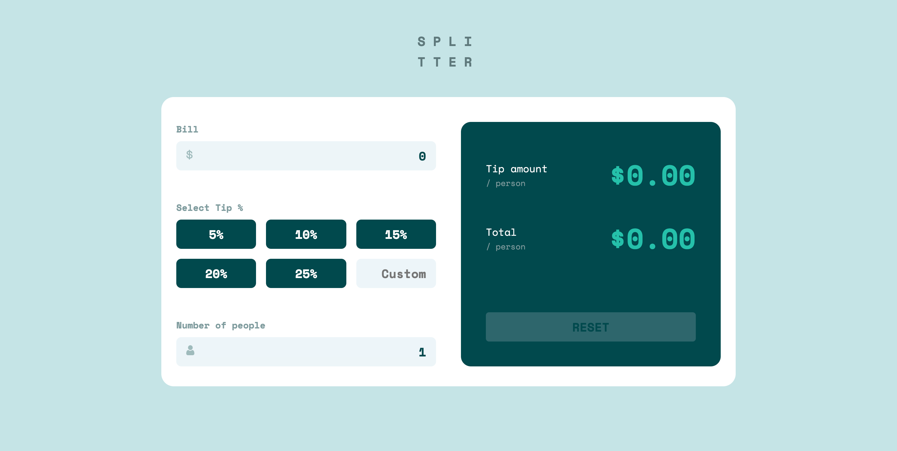

# Frontend Mentor - Tip calculator app solution

This is a solution to the [Tip calculator app challenge on Frontend Mentor](https://www.frontendmentor.io/challenges/tip-calculator-app-ugJNGbJUX). Frontend Mentor challenges help you improve your coding skills by building realistic projects.

## Table of contents

- [Overview](#overview)
  - [The challenge](#the-challenge)
  - [Screenshot](#screenshot)
  - [Links](#links)
- [My process](#my-process)
  - [Built with](#built-with)
  - [What I learned](#what-i-learned)
  - [Continued development](#continued-development)
  - [Useful resources](#useful-resources)
- [Author](#author)

## Overview

### The challenge

Users should be able to:

- View the optimal layout for the app depending on their device's screen size
- See hover states for all interactive elements on the page
- Calculate the correct tip and total cost of the bill per person

### Screenshot

### Links

- Solution URL: [https://github.com/rv-rmcgavin/fe-mentor-tip-calculator](https://github.com/rv-rmcgavin/fe-mentor-tip-calculator)
- Live Site URL: [Add live site URL here](https://your-live-site-url.com)

## My process
- Install nextjs project with `--typescript` flag.
- Add [_document.tsx](./pages/_document.tsx) file and add types where needed in file.
- Add html link tag for google font `Space Mono`
  - The [style-guide.md](./style-guide.md) file say we will need font weights 400, 500, and 700. However, [google fonts](https://fonts.google.com/specimen/Space+Mono?query=space+mono) says you can only get 400 and 700.
  - Thanks for the curveball [Frontend Mentor](https://frontendmentor.io).
  - I'll put it in the request in [_document.tsx](./pages/_document.tsx) anyways and just see what happens.
- Clean up [index.tsx](./page/index.tsx). 
  - Delete the css module stuff. I won't be using it.
- Delete `./styles/Home.module.css`
- Install [Styled Components](https://styled-components.com/)
  - `npm install --save styled-components`.
- Set up global styles file using styled-components.
  - [global.ts](./styles/global.ts)
- SURPRISE: I need to get the types for styled-components now by running `npm install --save @types/styled-components`.
- No surprise: I have untyped `theme`, `colors`, and `breakpoint` variables in [global.ts](./styles/global.ts).
- I read styled-components's TypeScript [documentation](https://styled-components.com/docs/api#typescript).
- Ok cool so according to ☝️ I need to create a declarations file, extend the default theme, and create a theme. 
- I read TypeScript's documentation on [declaration files](https://www.typescriptlang.org/docs/handbook/declaration-files/introduction.html)
- Eventually I realize I just need to make folders and files at `@types/styled.d.ts` and `/styles/theme.ts`.
- I set up [@types/styled.d.ts](@types/styled.d.ts) and [/styles/theme.ts](/styles/theme.ts).
  - The theme and the type declaration file seem to check out, but I am having some problems with [/styles/global.ts](/styles/global.ts).
  - I am getting an error `Property 'primary' does not exist on type '{}'`.
  - I resolved this by removing the default values `theme` and `colors`.
  - Typically I write these as `theme = {}` and `colors = {}`. It's a practice I've gotten used to when writing React because you don't want your app to crash if it tries to call `.length()` for example on `undefined`, completely halting a user who is unlucky enough to get this error. It also is often just needed because not all data is ready at one time in react, so we have defaults that get used and then new data causes rerenders until we get what we want. Without the default though, it just stops. I'm curious to see if using TypeScript somehow is going to give default values where needed, or if there is a different way to write your types with defaults that won't causes the error above.
- Ok Boom! Add the `<ThemeProvider>` and `<GlobalStyle />` components to `/pages/_app.tsx` and we complete setting up styled-components with TypeScript.
  - It was all mostly harmless too. How about that.
- Gather inputs and outputs for this app:
  - Inputs:
    - Total Bill - Number
    - Percentage of - Number
    - Number of people to split with - Number
  - Outputs:
    - The dollar tip amount per person - Number
    - The dollar total amount per person - Number
- Build out a mobile mockup with no functionality simply to achieve the mobile design.
- I did that, and then it became very easy to figure out how to just do it with all the values. It's nearly done now. Not much left but the tweaks.
- Break down Calculator component in to separate components: Bill, TipPercent, People, Display(output).
- Write reset function that I forgot about.
- Write function to get all my line item data.
- Update styled components to use the DefaultTheme interface.
- Style it for Desktop.
- Tweak vertical spacing between elements.
- Add icons to the inputs
  - Used a psuedo element on the label, url encoded the svg, and put it on a `background-image` property.
  - I got to use my [alfred-svg](https://github.com/rickMcGavin/alfred-svg) workflow. It's been ages since I used that.
- Set up the correct active states styling.
- Add ability to disable reset button.
- Make a calculator interface
### Built with

- Mobile-first workflow
- Semantic HTML5 markup - _sure why not say this?_
- Flexbox
- [TypeScript](https://www.typescriptlang.org/) - Types for JS
- [React](https://reactjs.org/) - JS library
- [Next.js](https://nextjs.org/) - React framework
- [Styled Components](https://styled-components.com/) - For styles

### What I learned

For me, this is largely about practice, staying sharp with Frontend skills, and learning how TypeScript works with a React project. Ultimately, it will serve as a reference for myself to work with TypeScript in React and Nextjs. I'm also trying to push myself to document as much of my process as possible while going through this. Not only to serve as a tool for my own future use, but simply for the journey of spending that much time focused on my own process and gleaning what I can from that.

A lot of what I learned is probably covered in my excessive process section above. 

### Continued development

I'd like to set up [eslint airbnb eslint config](https://www.npmjs.com/package/eslint-config-airbnb-typescript) probably at the beginning of future projects since it wouldn't really benefit me now that I've completed this one.

### Useful resources

- [TypeScript Docs](https://www.typescriptlang.org/) - Official TypeScript docs. Helped in particular with declaring types for objects. 
- [TypeScript Docs for styled-components](https://styled-components.com/docs/api#typescript) - Official TypeScript docs for styled-components. Very helpful and brief for getting types set up with styled-components.

## Author

- Website - [Rick McGavin](https://rickmcgavin.github.io)
- Frontend Mentor - [@rickMcGavin](https://www.frontendmentor.io/profile/rickMcGavin)
- Twitter - [@rickmcgavin](https://www.twitter.com/rickmcgavin)
